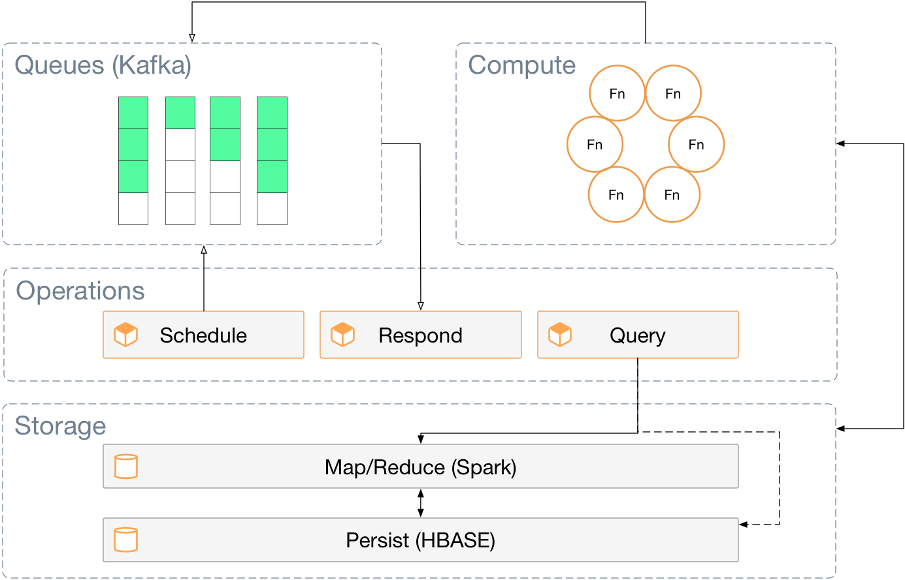
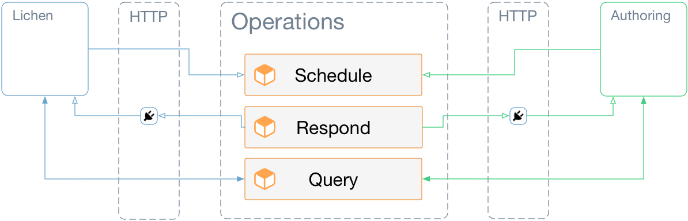

# Summary

This document describes the fundamental architecture of the **XA Data
Fabic** platform (XAF). It is the fundamental data processing system
for XA, Lichen and related applications. It is a container-based,
cloud-native system built on [Apache
Kafka](https://en.wikipedia.org/wiki/Apache_Kafka) and
[Spark](https://en.wikipedia.org/wiki/Apache_Spark). The computational
model of the system is derived from [message-based
designs](https://en.wikipedia.org/wiki/Message-oriented_middleware)
and [CQRS](https://en.wikipedia.org/wiki/Command–query_separation),
with inspiration from [AWS
Lambdas](https://en.wikipedia.org/wiki/AWS_Lambda).

# Architecture

The architecture is arrayed in three layers: Storage, Compute and
Operations.

## Storage

The foundation of the architecture is built from Apache Spark on top
of [Apache HBASE](https://en.wikipedia.org/wiki/Apache_HBase). This
yields a solid, distributed storage system accessed via a distributed
map/reduce system. All XA data (rules, tables, documents etc) are
retained in this layer. Services and Functions (detailed later) will
access data from the HBASE cluster via the map/reduce component
(Spark). Direct access to *some data* that is *operational* in nature
may be provided by direct access to the storage (rather than
map/reduce) if map/reduce proves to be too cumbersome for potentially
simple data access (for example, retrieving a list of rules for
display in a UI).

By design, the Storage Layer will be deployed and managed
*independantly* of the other Layers in the architecture. This will
allow the critical core functionality provided by the Compute Layer to
operate at arms length of this Layer. With this separation in place,
the core functionality can be improved incrementally and deployed
against different Storage Layers that do not retain sensitive
financial information from day-to-day operations. This will facilitate
testing and improve development to deployment turn-around time.

## Compute

This layer is built on two primitive concepts: Tasks and Functions.

Functions are arrayed in a cluster of containers (Docker) that provide
*very simple*
[micro-services](https://en.wikipedia.org/wiki/Microservices) that are
inspired by AWS Lambdas and [serverless computing
concepts](https://en.wikipedia.org/wiki/Serverless_computing). Functions
represent single operations from the Rule Expressions (Xalgo 2.0) or
inbound handlers of Tasks. They are designed to be purely functional
(the same inputs yield the same outputs in subsequent
invocations). Since they are implemented as contained micro-services,
Functions can be started and stopped automatically by the clustering
system to meet the demands of scale. Functions receive their input and
place their output on Task queues.

Tasks represent solitary compute requests for the Function cluster
(discover rules for a document, lookup data from a table, etc). They
are scheduled using topics and streams provided by Apache Kafka. The
Operations layer has access to Tasks in order to enqueue requests for
computation and to listen for results of those requests.

## Operations

This layer provides the public API access to the Task layer in order
to schedule computations, to receive results and to query for
information from the system.

All requests for the system enter via the Schedule Service as
Tasks. These Commands are *pseudo-transactional* in that **no**
results appear until all internal elements of the Tasks are
satisfied. Examples of Tasks: submitting a document for processing,
adding or updating a Rule, etc.

External applications may register to receive events related to
processing or results via the Events Service via a Web Socket.

Any external application that needs information about the system may
perform a synchronous Query via the Query Service. This might include
meta-data like lists of rules or the results of a computation. This
service will also allow for the registration of Stored Queries that
will yield matching data via the Events Service when new data arrives
in the Storage Layer.

# Deployment

*This section is still a work in progress. All aspects have been
considered, but some further investigation of [Apache
Mesos](https://en.wikipedia.org/wiki/Apache_Mesos) is required to
solidify the technology that will support it.*

Currently, it is expected that the Fabric will be deployed using
[Docker](https://en.wikipedia.org/wiki/Docker_(software)) containers
managed with Docker Compose /
[Kubernetes](https://en.wikipedia.org/wiki/Kubernetes) using [Rancher
2.0](https://rancher.com/rancher2-0/) as the management system. It
will be deployed in three independant *compositions* representing the
three layers described earlier in this document. This compositions
will run on independant cloud infrastructures in order to correctly
manage the different scaling requirements of each (Compute is
on-demand, but Storage and Operations are generally scaled on initial
deployment).

# Access

Applications (Lichen, Authoring) access the Fabric via the Operations Layer. To submit processing requests, the application would use the public API of the Schedule service. To receive results, when they eventually become available, the application would request a listening Web Socket connection from the Respond service and begin to listen on that connection. To make simple queries about the Fabric, the public REST API of the Query service would be used.

# Example Lichen Usage

This section describes how the classic Lichen rule processing request
would be handled by the Fabric.

1. A document (this is an *internal* processable document derived from
   the UBL document that Lichen received) would be delivered to the
   Fabric via the Schedule service. This would enqueue a Task in the
   Compute layer.

2. A Function would be instantiated (or reused if already live and
   idle) to process the Task from (1). Using Spark map/reduce, an
   ordered stream of relevant Rules would be generated and combined
   with the document to create a new stream of Tasks.
   
3. Functions would be triggered from the Task stream generated in (2),
   each would process a single Rule application across the associated
   document. This would generate a stream of rules and items from the
   document that would produce a new stream of Tasks.
   
4. As in (3), Functions would be triggered to handle each rule and
   item combination. This effectively applies the Rule to an atomic
   item in the document. Out of this application, a stream of result
   Tasks would be created.
   
5. A Function would be triggered from the item result stream to
   reassemble the document based on the results from (4). Spark
   map/reduce would be used to perform this reassembly, storing the
   resulting revision in the permanent storge. Ultimately, a results
   Task would be queued.
   
6. The Events Service would signal the listening Lichen application
   based on the results Task using the Web Socket connection.
